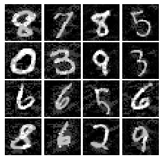
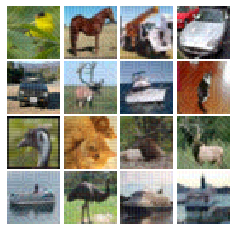
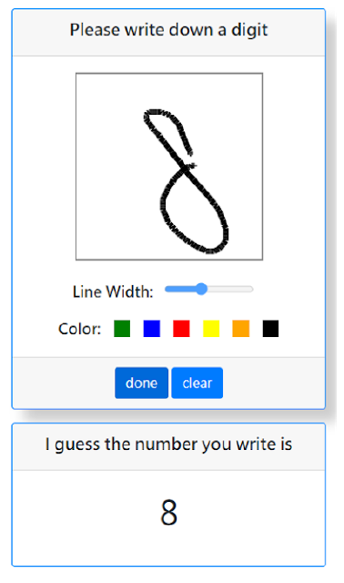

# Education
* BSc. in Electronic and Computer Engineering, [National Taiwan University of Science and Technology](https://www.ntust.edu.tw/index.php), Taiwan (2016-2020)
* Exchange Study at [Linköping University](https://liu.se/en), Sweden (2020.03-2020.06)

# Experience
* Part-Time Research Assistant at CTIT, Academia Sinica, Tapei, Taiwan (2020.07-2020.11, 2021.07-)

# Publication
* RePIM: Joint Exploitation of Activation and Weight Repetitions for In-ReRAM DNN Acceleration, Chen-Yang Tsai, Chin-Fu Nien, **Tz-Ching Yu**, Hung-Yu Yeh, Hsiang-Yun Cheng, to appear in IEEE/ACM Design Automation Conference 2021

# Project
* Generating Adversarial Examples with Conditional Generative Adversarial Networks\
   \[[code](https://github.com/kurimulion/Adversarial_examples)] \[[report](assets/pdf/adversarial_example_revised.pdf)\] \[[poster](assets/pdf/adversarial_examples_poster.pdf)\]\
  
  

* Quick Draw, but only Digits: A Ditig Recognition System Deployed on GCP, term project of the course "Cloud Computing and Cyber Security", NTU\
[[code](https://github.com/kai860115/Quick-Draw-but-only-Digits)\] \[[report](assets/pdf/Term_Project_Report_Quick_Draw_but_only_Digits.pdf)\] (In Chinese)\

